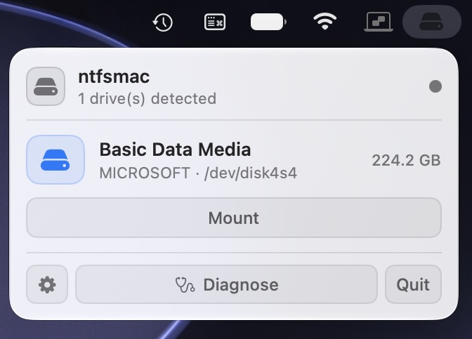
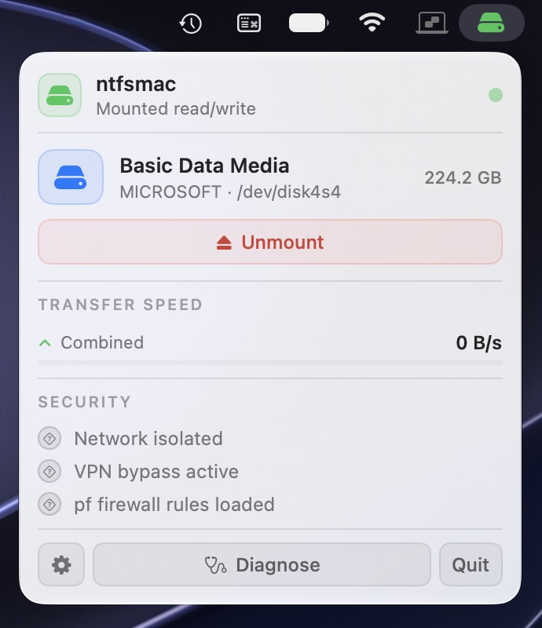
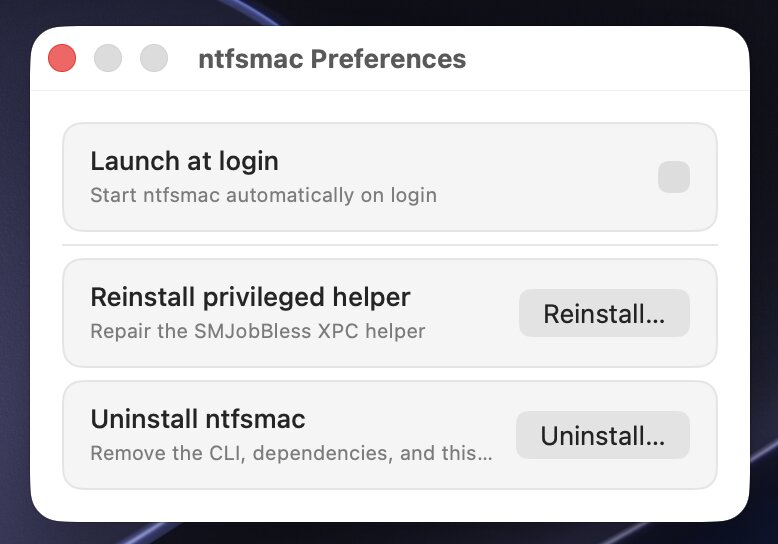

# ntfsmac

NTFS read/write on Apple Silicon macOS — no kernel extension, no SIP modification.

Wraps [`anylinuxfs`](https://github.com/nohajc/anylinuxfs) (a `libkrun` microVM running
`ntfs-3g`), exported to macOS over NFS on a host-only `vmnet` bridge. CLI first, GUI second.

## Why

macOS does not have native NTFS write support. The usual fixes are a kernel extension
(blocked by newer SIP policy) or a paid third-party driver. ntfsmac takes a third path: a
disposable Linux microVM does the actual NTFS write, and macOS just mounts it over NFS —
no kext, no SIP toggle, no System Extension approval dance.

## Requirements

- **Apple Silicon (arm64) only.** No Intel fallback.
- macOS 13.0+.

## Install

CLI, via Homebrew tap:

```sh
brew tap khr898/ntfsmac
brew install ntfsmac
ntfsmac diagnose
```

GUI: download the latest ad-hoc-signed `.dmg` from [Releases](../../releases) — not
distributed as a Homebrew cask (see [Signing & distribution](#signing--distribution)).

## Usage

```sh
ntfsmac mount <disk identifier>      # e.g. disk4s1 — mounts read/write by default
ntfsmac unmount <disk identifier>
ntfsmac diagnose                     # environment + bridge + helper health check
ntfsmac uninstall                    # removes CLI, runtime state, and the GUI's privileged helper
ntfsmac help
```

Device identifiers are validated against `^disk[0-9]+s[0-9]+$` before any command touches
them — see [SECURITY.md](SECURITY.md).

## GUI

Menu-bar app (no Dock icon): pick a drive, mount it, get out of the way. Menu-bar icon color
tells the whole story — grey idle, blue mounting, green mounted read/write, yellow mounted
read-only (dirty journal), red error. Full button-level spec in [GUI-PLAN.md](GUI-PLAN.md).






## Architecture

```
macOS ── NFS (soft mount) ──> vmnet host-only bridge ──> libkrun microVM ── ntfs-3g ──> NTFS drive
```

Every control that mounts, unmounts, or touches `pf`/route state goes through a SMJobBless
XPC helper — the GUI never shell-outs to `sudo` directly. Full architecture and phased build
plan: [docs/dev/PLAN.md](docs/dev/PLAN.md).

## Signing & distribution

Ad-hoc signed only (`codesign -s -`) — no paid Apple Developer account, no notarization.
That's why the GUI ships as a DMG (never a Homebrew cask) and the CLI lives in a personal
tap (never `homebrew-core`).

## Status

CLI-first build, currently in the Phase 3 GUI build-out. See
[docs/dev/PLAN.md](docs/dev/PLAN.md) for the full phase plan.

## Contributing

See [CONTRIBUTING.md](CONTRIBUTING.md). Working with an AI coding agent? Start with
[CLAUDE.md](CLAUDE.md) (also readable as [AGENTS.md](AGENTS.md)).

## Security

Please report vulnerabilities per [SECURITY.md](SECURITY.md) rather than filing a public issue.

## License

MIT — see [LICENSE](LICENSE).
