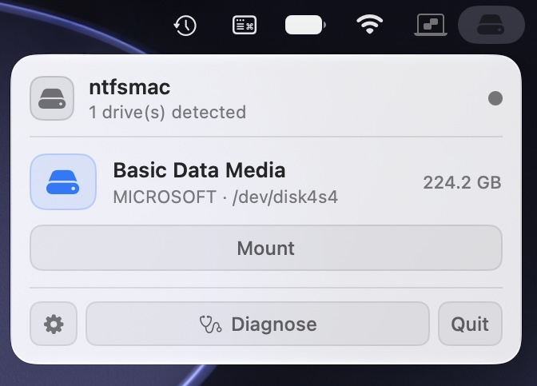
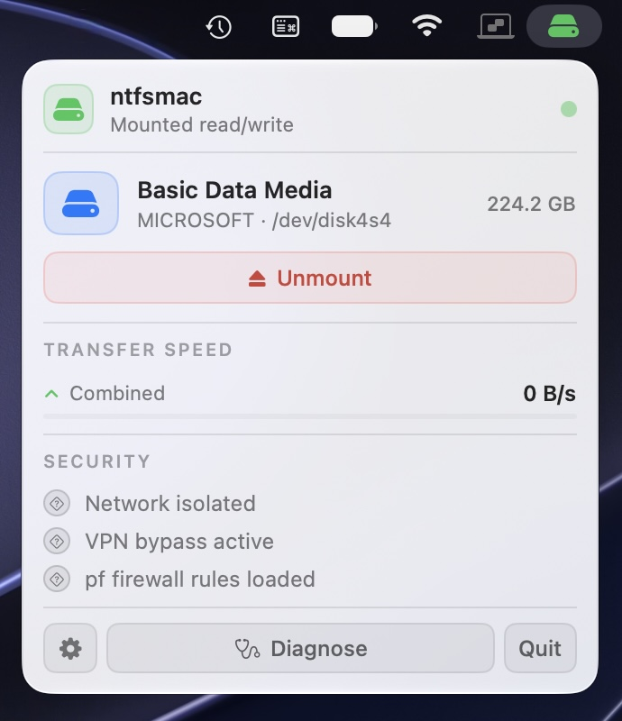
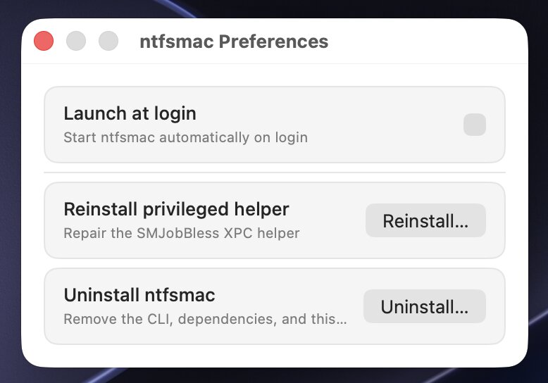

# ntfsmac

NTFS read/write (and ext2/3/4) on Apple Silicon macOS — no kernel extension, no SIP modification.

Wraps [`anylinuxfs`](https://github.com/nohajc/anylinuxfs) (a `libkrun` microVM running
`ntfs-3g`), exported to macOS over NFS on a host-only `vmnet` bridge. CLI first, GUI second.

## Why

macOS does not have native NTFS write support. The usual fixes are a kernel extension
(blocked by newer SIP policy) or a paid third-party driver. ntfsmac takes a third path: a
disposable Linux microVM does the actual NTFS write, and macOS just mounts it over NFS —
no kext, no SIP toggle, no System Extension approval dance.

The same microVM path also mounts **ext2, ext3, and ext4** partitions: the guest kernel's
built-in `ext4` driver handles all three (blkid auto-detects the type — no `--fs-driver`
needed). No extra packages or kernel modules ship for it; `ext4.ko`/`jbd2.ko`/`mbcache.ko`
are already built into the vendored kernel image.

## What's new

- **ext2/3/4 mount support** — mount Linux ext2, ext3, and ext4 partitions the same way as
  NTFS. The guest kernel's built-in ext4 driver handles all three (blkid auto-detects the
  type, no `--fs-driver` flag needed); no extra packages or kernel modules ship for it.
- **Multiple concurrent mounts** — mount more than one drive at once. The CLI mounts each
  device independently, and the GUI's mounted view lists every mounted drive with its own
  status and speed indicator (the old single-drive "Combined" speed readout is gone).
- **More useful, privacy-safe diagnostics** — CLI and GUI reports identify expected and detected
  host-runtime versions, audited source commits, the installed Alpine/cache version and guest
  package versions, plus app/build, system, helper, kernel, network, and mount health without
  exposing local paths or network identity.
- **Reproducible first-run environment** — the runtime pulls an immutable Alpine arm64 digest,
  keeps versioned caches side by side, and packaging rejects floating image references.
- **Authoritative mount state and transport diagnostics** — the GUI reconciles anylinuxfs session
  evidence with the host NFS mount table, while diagnostics fail closed unless an active ntfsmac
  mount uses the expected private vmnet path and effective `soft` NFS parameters.
- **Per-session network security** — each mount owns its evaluated PF child anchor, PF enable
  reference, and only the exact VPN-bypass host route it needs; teardown never flushes global PF
  state or removes another session's route.

## Requirements

- **Apple Silicon (arm64) only.** No Intel fallback.
- macOS 13.0+.

## Install

CLI, via Homebrew tap:

```sh
brew tap khr898/ntfsmac
brew install ntfsmac
ntfsmac diagnose
```

GUI: download the latest ad-hoc-signed `.dmg` from [Releases](../../releases) — not
distributed as a Homebrew cask (see [Signing & distribution](#signing--distribution)).

## Usage

```sh
ntfsmac mount <disk identifier>      # e.g. disk4s1 — mounts read/write by default
ntfsmac unmount <disk identifier>
ntfsmac diagnose                     # environment + bridge + helper health check
ntfsmac uninstall                    # removes CLI, runtime state, and the GUI's privileged helper
ntfsmac help
```

BitLocker volumes appear in the drive list as `BitLocker`. In the menu-bar app, click
**Mount**, enter the BitLocker password or 48-digit recovery key, then choose **Unlock & Mount**.
The credential is used only for that mount and is not saved. For scripted CLI use, pass it on
standard input so it does not appear in shell history or the process list:

```bash
printf '%s\n' "$BITLOCKER_CREDENTIAL" | sudo ntfsmac mount --bitlocker-credential-stdin disk4s1
```

Device identifiers are validated against `^disk[0-9]+s[0-9]+$` before any command touches
them — see [SECURITY.md](SECURITY.md).

## Troubleshooting

Installed but a drive won't mount, or the app "starts but does nothing"? Run the built-in
health check first — it's read-only and never mounts anything:

```sh
ntfsmac diagnose          # human-readable
ntfsmac diagnose --json   # same data on one line, handy for bug reports
```

From the GUI, a normal click on **Diagnose** shows the plain-language summary. For a developer
report, hold **Command (⌘)** while clicking **Diagnose**: ntfsmac runs the same read-only
`diagnose --json` command and opens a save panel for a formatted `.json` file. You choose where
the file is written; ntfsmac never uploads or sends it automatically. Review it if desired, then
attach it manually to a bug report.

What each line means:

| `diagnose` line | Meaning / fix |
| --- | --- |
| `ntfsmac version: <release> (<build>)` | Identifies the exact app/CLI build that produced the report. The same value appears below the Settings title. |
| `macOS version: <ver>` / `architecture: <arch>` | Must be **13.0+** and `arm64`. An `unsupported` note is fatal. |
| `privileged helper: installed` | Required by the GUI for privileged mount/network operations. A CLI-only installation can legitimately report `not installed`. |
| `vendor binaries missing: N` (N > 0) | A vendored binary (`anylinuxfs`/`gvproxy`/`vmnet-helper`/`vmproxy`) wasn't found. Reinstall: `brew reinstall ntfsmac`, or re-run `install.sh`. |
| `quarantined binaries: N` (N > 0) | Gatekeeper quarantined a vendored binary, so it won't launch. Reinstall (the installer strips the xattr), or clear it: `xattr -dr com.apple.quarantine <path>`. |
| `kernel pin: mismatch` / `missing` | The pinned `modules.squashfs` kernel image doesn't match `sources.lock`. Reinstall to restore the pinned image. |
| `anylinuxfs version: <detected> (expected <version>)` | Separates the installed host runtime from the audited source version. A mismatch is degraded and should be repaired by reinstalling. |
| `Alpine runtime: <state>` | Reports the approved tag/digest and whether the matching versioned cache is complete, missing, legacy, interrupted, or mismatched; Diagnose never downloads or deletes a cache. |
| `guest ntfs-3g` / `guest nfs-utils` | Reports fixed package-version tokens read from the selected guest cache, or `not installed` / `unavailable` without exposing local paths. |
| `vmnet bridge: down` | Expected when nothing is mounted; it should read `up` while a volume is mounted. If it stays `down` during a mount, approve the vmnet-helper permission prompt and retry. |
| `active network helper: <state>` | Uses fixed privacy-safe tokens to distinguish `vmnet`, `gvproxy`, mixed, missing, or unavailable evidence. |
| `NFS transport contract: <state>` | Active ntfsmac mounts are healthy only when they resolve inside the private vmnet pool, route through a bridge, use effective `soft` parameters, and have no loopback NFS listener. |
| `VPN default route: detected` | A tunnel owns the default route. This is informational; the report does not record which VPN/interface or any address/route details. |
| `current NFS mount count: N` | Number of active NFS mounts, without their names or paths. |
| `overall: degraded` | One of the fatal checks above failed — fix that line first. |

When macOS asks for Full Disk Access it may show the standalone privileged tool with a generic
executable icon and its technical service name, `com.khr898.ntfsmac.helper`. This is **ntfsmac
Helper**, not an unrelated package; enable that exact entry. The SMJobBless helper is one signed
executable rather than an app/resource bundle, so its icon cannot be customized independently
without changing the privileged-helper architecture.

**First mount needs network (one-time per approved runtime).** The first mount that needs a
runtime pulls the exact Alpine Linux arm64 image identified by the tag and SHA-256 digest in
`build/sources.lock` (~50–150 MB). It initializes a tag/digest/version-specific cache beside any
legacy or older cache instead of replacing it. Installation, Diagnose, and opening Settings never
download or remove a rootfs. Once the matching cache is complete, later mounts reuse it offline.

**Can't write to an ext volume / `Operation not permitted`.** ext2/3/4 are real
Unix filesystems with their own ownership bits, so ntfsmac auto-passes
`--ignore-permissions` for any ext-family drive (the NFS export gets
`all_squash,anonuid=0,anongid=0` and the macOS mount gets `noowners` — files appear
owned by you and are writable). You should not need to pass `--ignore-permissions`
yourself for ext; if an ext mount is read-only, reinstall (older CLI builds had a bug
that skipped the flag for unlabeled ext drives). Verify the flag reached the mount:

```sh
mount | grep nfs     # expect "noowners" in the options for an ext volume
```

If `noowners` is present but `ls`/`cp` on the mounted volume still says
`Operation not permitted`, the volume is writable but **macOS is blocking the
app's access to the mount point** — a privacy/TCC gate, not an NFS permission
issue. This only affects access *from that app*:

- **GUI** — the ntfsmac app needs Full Disk Access, which it prompts for on
  first mount (`FDA_REQUIRED`). Grant it once and the GUI reads/writes fine.
- **CLI** — Terminal needs Full Disk Access **only if you want to write from
  the Terminal** (e.g. `cp`, `tee`, shell redirects into `/Volumes/<vol>`).
  With Terminal FDA off, the mount is still writable — Finder and other
  FDA-granted apps can read/write it — but Terminal itself gets
  `Operation not permitted`. To use the CLI for writes, grant it: **System
  Settings → Privacy & Security → Full Disk Access → add Terminal**, restart
  Terminal. Readers who only ever write via Finder can leave Terminal FDA off.

**A drive doesn't show up / macOS says "unidentifiable."** ntfsmac mounts
**partitions** (`diskNsN`, e.g. `disk4s1`), never a whole disk (`disk4`) — the device
name is validated against `^disk[0-9]+s[0-9]+$` before any command touches it. If macOS
shows "The disk you attached was not readable by this computer" and `diskutil list`
shows the drive with no partition rows under it (a `diskN` with a blank `0:` line, no
`diskNsN` children), the drive has **no partition table** — the filesystem was written
straight onto the raw disk. macOS can't read a partition map so it never publishes a
`/dev/diskNsN` slice node, and the app has nothing to enumerate. Confirm with:

```sh
diskutil list            # external disk with no diskNsN rows = whole-disk filesystem
diskutil info diskN       # Whole: Yes, File System: None, Content: None = no GPT/MBR
ls -l /dev/diskN*         # no /dev/diskNsM node = nothing to mount
```

Fix is on the disk, not the app: it needs a GPT partition table + a partition inside it.
macOS can't create ext4, so repartition on a Linux machine (or a Linux live USB), back up
the data first if it matters — the existing fs starts at offset 0 and won't line up with a
new GPT partition (which starts at 1 MiB), so this is not a non-destructive operation:

```sh
# on a Linux box, /dev/sdX = the drive
sudo parted /dev/sdX mklabel gpt
sudo parted /dev/sdX mkpart primary ext4 1MiB 100%
sudo mkfs.ext4 /dev/sdX1
# restore your data onto /dev/sdX1, then replug on the Mac
```

After that macOS publishes `/dev/diskNsM`, the "unidentifiable" prompt (now about the
partition, not the whole disk) is harmless — press Ignore — and `ntfsmac mount` / the GUI
lists it. (Whole-disk NTFS drives hit the same wall; they're just usually pre-partitioned.)

Filing a bug? Please include:

- the `ntfsmac diagnose --json` output, or the JSON file saved with **⌘-click Diagnose** in the GUI,
- your macOS version (`sw_vers -productVersion`) and Mac model,
- the disk identifier you used, in `diskNsN` form (e.g. `disk4s1` — a partition, not the whole `disk4`).

For security issues, see [SECURITY.md](SECURITY.md) — please don't file those publicly.

## GUI

Menu-bar app (no Dock icon): pick a drive, mount it, get out of the way. Menu-bar icon color
tells the whole story — grey idle, blue mounting, green mounted read/write, yellow mounted
read-only (dirty journal), red error. Full button-level spec in [GUI-PLAN.md](docs/dev/GUI-PLAN.md).

<div align="center">
  <table>
    <tr>
      <td valign="middle" align="center"></td>
      <td valign="middle" align="center"></td>
      <td valign="middle" align="center"></td>
    </tr>
  </table>
</div>


## Architecture

```
macOS ── NFS (soft mount) ──> vmnet host-only bridge ──> libkrun microVM ── ntfs-3g ──> NTFS drive
```

Every control that mounts, unmounts, or touches `pf`/route state goes through a SMJobBless
XPC helper — the GUI never shell-outs to `sudo` directly. Full architecture and phased build
plan: [docs/dev/PLAN.md](docs/dev/PLAN.md).

`MountController.mountedDrives` is a presentation cache, not proof of a mount. The GUI pairs
anylinuxfs status with the macOS NFS mount table on launch, popover open, Refresh, after helper
completion, and on a bounded poll. Missing or contradictory evidence remains recoverable but is
shown as warning/unknown rather than green.

The privileged mount transaction measures the newly created private `/30`, installs and reads back
a direct child of the evaluated macOS `com.apple/*` PF path, acquires one PF enable reference, and
repairs only an exact VPN-captured guest route before the backend NFS readiness check can complete.
State is root-owned and per device; unmount and stale-session recovery release only resources whose
ownership can still be proven.

## Signing & distribution

Ad-hoc signed only (`codesign -s -`) — no paid Apple Developer account, no notarization.
That's why the GUI ships as a DMG (never a Homebrew cask) and the CLI lives in a personal
tap (never `homebrew-core`).

## Status

CLI-first build, currently in the Phase 3 GUI build-out. See
[docs/dev/PLAN.md](docs/dev/PLAN.md) for the full phase plan.

## Contributing

See [CONTRIBUTING.md](CONTRIBUTING.md). Working with an AI coding agent? Start with
[CLAUDE.md](CLAUDE.md) (also readable as [AGENTS.md](AGENTS.md)).

## Security

Please report vulnerabilities per [SECURITY.md](SECURITY.md) rather than filing a public issue.

## License

PolyForm Noncommercial License — see [LICENSE](LICENSE.md).
